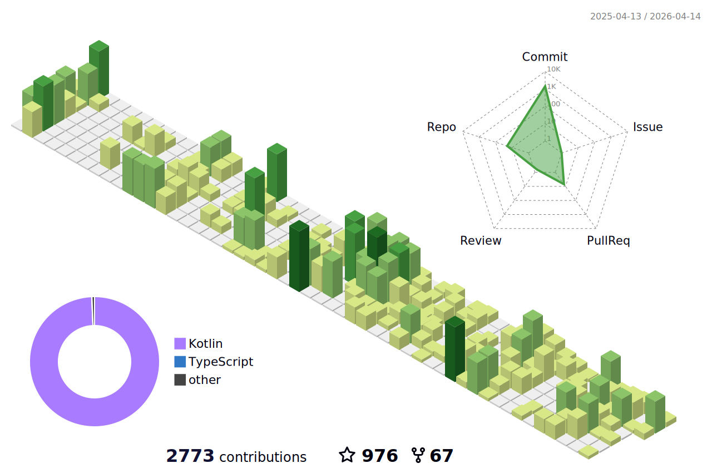

<!--   my-icons -->
<p align="center">
    <a href="https://github.com/suqi8/suqi8"></a>
    <a href="https://github.com/python/cpython"></a>
    <a href="https://github.com/suqi8/suqi8/graphs/contributors"></a>
    <a href="https://github.com/suqi8/suqi8/stargazers"></a>
    <a href="https://github.com/suqi8/suqi8/network/members"></a>
       
</p>

<!--   my-header-img -->

<a href="https://www.python.org/"></a>


<!--   my-ticker -->    
[](https://git.io/typing-svg)


<!--   my-skils -->

| 分类                                            | 内容                                                                                                                                                                                                                                                                                                                                                                                                                                                                                                                                                                                                                                                                                                                                                                                                                                                                                                                                                                                                                                                                                                                                                                                                                                                                                                                                                                                                                                                                                                                                                                                                                                                                                                                                                                                                                                                                                                                                                                  |
|-------------------------------------------------|-----------------------------------------------------------------------------------------------------------------------------------------------------------------------------------------------------------------------------------------------------------------------------------------------------------------------------------------------------------------------------------------------------------------------------------------------------------------------------------------------------------------------------------------------------------------------------------------------------------------------------------------------------------------------------------------------------------------------------------------------------------------------------------------------------------------------------------------------------------------------------------------------------------------------------------------------------------------------------------------------------------------------------------------------------------------------------------------------------------------------------------------------------------------------------------------------------------------------------------------------------------------------------------------------------------------------------------------------------------------------------------------------------------------------------------------------------------------------------------------------------------------------------------------------------------------------------------------------------------------------------------------------------------------------------------------------------------------------------------------------------------------------------------------------------------------------------------------------------------------------------------------------------------------------------------------------------------------------|
| **语言 / IDE**                                  |              |
| **领域知识**                                    | [](https://github.com/search?q=user%3Asuqi8+Android&type=Repositories) [](https://github.com/suqi8/OShin) [](https://github.com/suqi8/ImageStudio) [](https://github.com/suqi8/Miuix-KernelSU) [](https://github.com/suqi8/YukiHookAPI) [](https://github.com/suqi8/UotanToolboxNT) |
| **持续集成 / 持续交付**                         |        |
| **数据库**                                      |    |
| **工具 / 技术栈**                               |         |


<!--   GitHub stats graph -->
### 📈 GitHub 活动图：

<!--   green snake -->

<!--   stats + languages -->
| .                                                                                                                                       | .                                                                                                                         |
|-----------------------------------------------------------------------------------------------------------------------------------------|---------------------------------------------------------------------------------------------------------------------------|
|  |  |


</img>

<!-- dark snake -->


<!--   profile-green-animate -->


<!--   grid-snake  -->


</img>
</img>

**📫 联系方式：**
<p align="left">
<a href="mailto:yogurt3383@gmail.com" target="blank"></a>
</p>

<div align="center">
<summary>奖杯：GitHub 主页奖杯</summary>
</div>

<p align="center"> 
<a href="https://github.com/ryo-ma/github-profile-trophy"></a>
</p>


   <!--machine-learning-->
```mermaid
graph TD;
    machine-learning-->数据;
    machine-learning-->算法;
    machine-learning-->统计模型;
    machine-learning-->特征工程;
    machine-learning-->评估指标;
    machine-learning-->部署;
   ```
   
 


<div align="center">
<summary>奖杯：Hackerrank 主页奖杯</summary>
</div>

<p align="center"> 

 

</p>


<!-- 我的家园 -->
  
 ```geojson
{
 "type": "FeatureCollection",
 "features": [
   {
     "type": "Feature",
     "id": 1,
     "properties": {
       "ID": 0
     },
     "geometry": {
       "type": "Polygon",
       "coordinates": [
         [
             [23.5,53.9],
             [32.6,52.6]
         ]
       ]
     }
   }
 ]
}

```


#### 感谢访问 :heart:

<p align="center"> 


此处访客计数自 2022 年 5 月 8 日开始统计
<a href="http://s01.flagcounter.com/more/ap7"></a>


## Star 历史

[](https://star-history.com/#suqi8/suqi8&Date)


